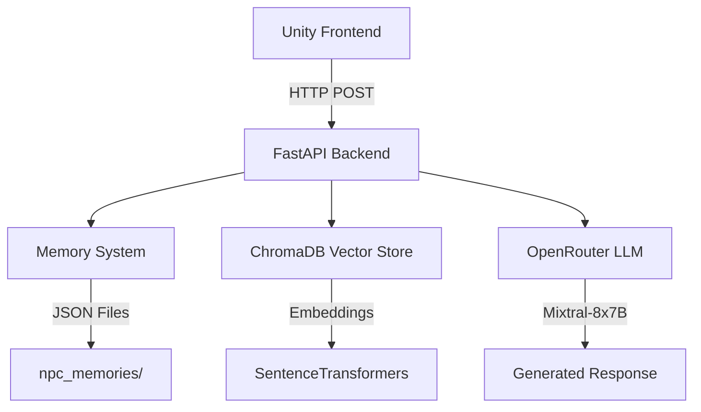

# 🧠 Memory-Based NPC System

> **A persistent, memory-based AI NPC framework for Unity — not just a chatbot.**

An AI-powered NPC interaction system that brings game characters to life with genuine memory, personality, and contextual awareness. Built with Unity, FastAPI, OpenRouter, and ChromaDB.

[](https://unity.com/)
[](https://fastapi.tiangolo.com/)
[](https://www.python.org/)
[](https://opensource.org/licenses/MIT)

---

## ✨ Features

### Core Capabilities

- **🧠 Persistent Long-Term Memory** — NPCs remember past conversations across sessions
- **⭐ Dynamic Reputation System** — Behavior adapts based on player actions
- **🎭 Distinct Personalities** — Each NPC has unique tone and behavior patterns
- **📚 RAG-Powered World Knowledge** — Retrieval-Augmented Generation for contextual lore
- **🔄 Real-Time Unity Integration** — Seamless communication between game and AI backend
- **💾 Stateful Architecture** — Memory persists even after backend restarts

### Why This Matters

This isn't a simple chatbot wrapper. This is a **stateful AI agent framework** that demonstrates:

- Memory management for interactive agents
- Personality conditioning via system prompts
- Vector database integration for knowledge retrieval
- Reputation-based emotional modeling
- Production-ready game-AI architecture

---

## 🎮 Demo

**Player Interactions:**
- Press **E** near NPC to initiate dialogue
- Type messages in the UI panel
- Watch NPCs respond with personality and memory
- See reputation changes affect NPC behavior
- Ask about locations to trigger RAG-based lore retrieval

**NPC Behaviors:**
- Remembers previous conversations ("As I told you last time...")
- Adjusts tone based on reputation (friendly → neutral → hostile)
- Retrieves relevant world lore when asked about locations
- Maintains consistent personality across interactions

---

## 📸 Screenshots

### Game Interface

*Player interacting with NPC in Unity - dialogue UI and proximity detection*

### Conversation Flow

*NPC responding with personality and memory context - showing reputation system in action*

### Backend API

*Interactive API documentation with endpoint details*

> **Note:** Add your screenshots to the `screenshots/` folder in the repository root.

---

## 🏗️ Architecture



**Request Flow:**
1. Player interacts with NPC in Unity
2. Unity sends message to FastAPI endpoint
3. Backend retrieves NPC memory and personality
4. RAG system fetches relevant lore (if applicable)
5. LLM generates contextual response
6. Memory updated with new interaction
7. Response sent back to Unity

---

## 📂 Project Structure

```
unity_backend/
├── main.py                    # FastAPI server & endpoints
├── memory_store.py            # NPC memory persistence logic
├── personality.py             # Personality system prompts
├── venv/                      # Python virtual environment
│
├── llm/
│   ├── generator.py           # OpenRouter API integration
│   └── prompt_builder.py      # System prompt construction
│
├── memory/
│   ├── long_memory.py         # Persistent conversation storage
│   └── short_memory.py        # Session-based context management
│
├── rag/
│   ├── embedder.py            # Sentence embedding generation
│   ├── retriever.py           # ChromaDB retrieval logic
│   └── lore/
│       └── world_lore.txt     # Game world knowledge base
│
└── vector_db/                 # ChromaDB storage (auto-generated)
    ├── chroma.sqlite3         # Vector database file
    ├── index/                 # Vector indices
    └── ...

screenshots/                   # Demo images for README
├── unity_interaction.png
├── conversation_flow.png
└── api_docs.png
```

---

## 🚀 Installation & Setup

### Prerequisites

- Python 3.8+
- Unity 6 (or Unity 2021+)
- OpenRouter API key ([Get one here](https://openrouter.ai/))

### Backend Setup

1. **Clone the repository**
```bash
git clone https://github.com/yourusername/memory-npc-system.git
cd memory-npc-system/unity_backend
```

2. **Create virtual environment**
```bash
python -m venv venv

# Windows
venv\Scripts\activate

# macOS/Linux
source venv/bin/activate
```

3. **Install dependencies**
```bash
pip install fastapi uvicorn chromadb sentence-transformers requests python-dotenv
```

4. **Configure API key**

Create a `.env` file in the `unity_backend/` directory:
```bash
OPENROUTER_API_KEY=your_api_key_here
```

5. **Run the server**
```bash
uvicorn main:app --reload
```

Server runs at: `http://127.0.0.1:8000`

Check API docs at: `http://127.0.0.1:8000/docs`

### Unity Setup

1. Open your Unity project
2. Add `DialogueManager.cs` to your Canvas
3. Add `NPCInteraction.cs` to NPC GameObjects
4. Configure NPCs:
   - Add `Collider2D` with `Is Trigger` enabled
   - Set NPC name in inspector
5. Ensure Player has tag `"Player"`
6. Configure backend URL in DialogueManager (default: `http://127.0.0.1:8000/chat`)

---

## 🧠 Core Systems

### 1. Dual Memory System

The system uses a **two-tier memory architecture**:

#### **Short-Term Memory** (`short_memory.py`)
- Maintains current session context
- Stores recent conversation turns
- Cleared between sessions
- Used for immediate context window

#### **Long-Term Memory** (`long_memory.py`)
- Persistent conversation history stored in JSON
- Survives backend restarts
- Tracks reputation over time
- Maintains full interaction history

**Example Memory Structure:**
```json
{
  "npc_name": "Farmer",
  "conversations": [
    {
      "player": "Hello!",
      "npc": "Good day to you, traveler!",
      "timestamp": "2025-02-14T10:30:00"
    }
  ],
  "reputation": 5,
  "total_interactions": 3
}
```

**Memory Features:**
- Dual-layer context management
- Automatic persistence to disk
- Conversation timestamps
- Reputation tracking across sessions

### 2. Reputation System

Player actions dynamically affect NPC attitudes:

| Player Action | Reputation Change | NPC Behavior |
|--------------|-------------------|--------------|
| Thanking, helping | +2 | Becomes warmer, more helpful |
| Neutral conversation | 0 | Maintains current attitude |
| Insults, threats | -3 | Becomes cold, suspicious |

**Reputation Tiers:**
- **10+** — Friendly & trusting
- **5-9** — Polite & professional
- **0-4** — Neutral & cautious
- **Negative** — Hostile & dismissive

### 3. RAG (Retrieval-Augmented Generation)

World lore is processed and stored for contextual retrieval:

**Pipeline:**
1. `world_lore.txt` chunked into semantic segments
2. Embedded using `SentenceTransformers`
3. Stored in ChromaDB vector database
4. Retrieved when player asks location-specific questions

**Example:**
- **Player:** "Tell me about Greenmeadow Plains"
- **RAG retrieves:** Lore chunk about Greenmeadow Plains
- **LLM generates:** Response incorporating retrieved knowledge

### 4. Personality System

Each NPC has a distinct personality template managed by `prompt_builder.py`:

```python
PERSONALITIES = {
    "Mayor": {
        "role": "Town leader",
        "tone": "Diplomatic, measured, political",
        "speech_pattern": "Formal with occasional warmth"
    },
    "Farmer": {
        "role": "Local agricultural worker",
        "tone": "Simple, warm, down-to-earth",
        "speech_pattern": "Casual with rural expressions"
    },
    "Adventurer": {
        "role": "Wandering hero",
        "tone": "Bold, energetic, storytelling",
        "speech_pattern": "Enthusiastic with adventure tales"
    },
    "Thief": {
        "role": "Underground operative",
        "tone": "Suspicious, clever, guarded",
        "speech_pattern": "Brief with hidden implications"
    }
}
```

**Prompt Construction:**
- System prompts built dynamically via `prompt_builder.py`
- Personality + memory + reputation combined
- Context-aware response generation
- Consistent characterization across interactions

---

## 📡 API Reference

### POST `/chat`

Send a message to an NPC and receive a contextualized response.

**Request:**
```json
{
  "npc_name": "Farmer",
  "npc_type": "villager",
  "message": "What crops do you grow?"
}
```

**Response:**
```json
{
  "reply": "Oh, mostly wheat and barley this season. The soil's been good to us, it has.",
  "reputation": 5,
  "memory_updated": true
}
```

**Query Parameters:**
- `npc_name` (required): NPC identifier
- `npc_type` (optional): NPC category for personality routing
- `message` (required): Player's input text

---

## 🛠️ Tech Stack

| Component | Technology | Purpose |
|-----------|-----------|---------|
| **Game Engine** | Unity 6 | Frontend game environment |
| **Backend** | FastAPI | RESTful API server |
| **LLM** | OpenRouter (Mixtral-8x7B) | Natural language generation |
| **Vector DB** | ChromaDB | RAG knowledge retrieval |
| **Embeddings** | SentenceTransformers | Semantic text encoding |
| **Memory** | JSON | Persistent state storage |
| **Language** | Python 3.8+ | Backend logic |
| **Frontend Language** | C# | Unity scripting |

---

## 🎯 Use Cases & Applications

This framework can power:

- **Open-world RPGs** — NPCs with genuine memory and relationships
- **Interactive narratives** — Characters that remember player choices
- **Educational simulations** — Historical figures with contextual knowledge
- **Virtual assistants** — Game guides with personality and state
- **Multiplayer experiences** — Persistent NPC relationships across sessions

**Potential Extensions:**
- Quest tracking and generation
- NPC-to-NPC gossip networks
- Emotional state modeling (happy, sad, angry)
- Faction reputation systems
- Multi-agent collaborative behaviors
- Cloud deployment for MMO-scale systems

---

## 📈 Performance Considerations

- **Memory:** JSON files are lightweight (< 50KB per NPC with 100+ interactions)
- **Latency:** Typical response time 1-3 seconds (depends on LLM API)
- **Scalability:** ChromaDB handles 100K+ documents efficiently
- **Optimization:** Implement caching for frequently accessed lore
- **Production:** Consider Redis for memory store in production environments

---

## 🤝 Contributing

Contributions are welcome! Areas for improvement:

- [ ] Emotional decay over time (reputation slowly returns to neutral)
- [ ] Multi-language support
- [ ] Voice synthesis integration
- [ ] NPC relationship graphs
- [ ] Quest memory and tracking
- [ ] Cloud backend deployment (Docker + AWS/GCP)
- [ ] Analytics dashboard for NPC interactions

**To contribute:**
1. Fork the repository
2. Create a feature branch (`git checkout -b feature/YourFeature`)
3. Commit changes (`git commit -m 'Add YourFeature'`)
4. Push to branch (`git push origin feature/YourFeature`)
5. Open a Pull Request

---

## 📝 License

This project is licensed under the MIT License - see the [LICENSE](LICENSE) file for details.

---

## 🙏 Acknowledgments

- **OpenRouter** for unified LLM API access
- **Chroma** for vector database infrastructure
- **Unity** for game development platform
- **FastAPI** for elegant Python API framework

---

## 👤 Author

**Your Name**
- GitHub: [@yourusername](https://github.com/yourusername)
- LinkedIn: [Your LinkedIn](https://linkedin.com/in/yourprofile)
- Portfolio: [yourwebsite.com](https://yourwebsite.com)

---

## 📬 Contact

Questions or suggestions? Open an issue or reach out directly.

Built with ❤️ as an experimental AI-game hybrid project demonstrating the future of interactive NPCs.

---

**⭐ If you find this project interesting, consider starring the repository!**
